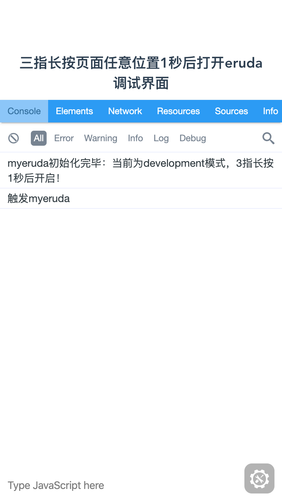

<!--
 * @Author: your name
 * @Date: 2019-11-04 20:38:33
 * @LastEditTime: 2019-11-12 00:45:11
 * @LastEditors: Please set LastEditors
 * @Description: In User Settings Edit
 * @FilePath: /src/github.com/blackmady/myeruda/README.md
 -->

# myeruda

一个快速集成于现代开发环境的彩蛋触发式调试工具(基于 eruda),配置简单,不需要按环境按需导入
配置即可，压缩前 2k 左右,加上 eruda 的大小

> mode 为 1 时，当 sessionStorage 中存在一条 key 为配置的 key 或默认为**myeruda**时即自动打开调式工具，或者 serch 中包含它也是

## 更新

### v2.0.0 修改打开触发方式

> 可通过在链接中加入一个指定的参数(默认为```?__myeruda__```)开启或关闭此功能,比如```http://mywebsite.com?t=1607654240271&__myeruda__=1```

[Github 地址](https://github.com/blackmady/myeruda)

[DEMO](https://blackmady.github.io/myeruda/)

<!-- ##  -->



### 使用说明

> 此工具由 typescript 编写,支持 typescript 和 javascript

```shell
  # 安装
  npm i myeruda -S
```

```javascript
// 使用
import myeruda from 'myeruda'
myeruda() //v2
```

参数说明如下：

```javascript
// option参数说明
// v2
interface IOption {
  // 关键的key 用于sessionStorage 和query的key 默认: __myeruda__
  key: string
  // 哪些环境开启此功能,默认: ['development','test']
  envs: string[]
  // eruda的配置 默认: {}
  setting?: object
  // 模式 1:sessionStorage+query 2:localStorage+query 3:auto 自动开启 默认: 1
  mode: number
}
```

### 其它版本请通过切换版本查看