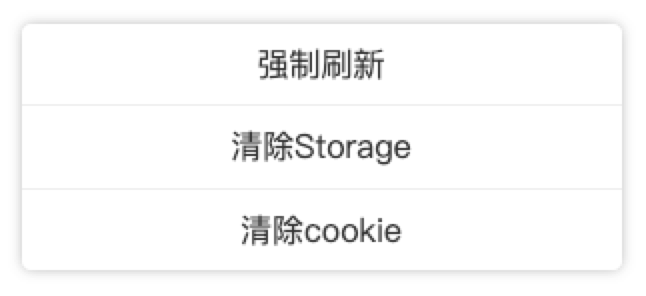

<!--
 * @Author: your name
 * @Date: 2019-11-04 20:38:33
 * @LastEditTime: 2019-11-12 00:25:10
 * @LastEditors: Please set LastEditors
 * @Description: In User Settings Edit
 * @FilePath: /src/github.com/blackmady/myeruda/README.md
 -->
# myeruda
一个快速集成于现代开发环境的彩蛋触发式调试工具(基于eruda),配置简单,不需要按环境按需导入
压缩前12k左右,开发环境下是加上eruda的大小,生产环境即使开启此功能也不会打包eruda,而是从CDN异步加载

> 调试工具界面默认隐藏,不影响测试与正常使用，可配置触发打开方式（默认为三指长按界面1秒），可集成至生产环境，在生产环境下eruda会从CDN(bootcdn.cn)异步加载，不会打包到本地，解除了打包后文件太大的困扰
### v1.3.0 加入自定义菜单功能
> 长按eruda控制按钮打开菜单,有以下默认菜单
- 强制刷新:解决微信浏览器等环境下调试时烦人的缓存问题
- 清理Storage (localStorage,sessionStorage)
- 清理Cookie (当前域名及基域名)

### v1.2.0 (按需打包与加载，只管调用，环境问题交给我)
> 生产环境不再打包eruda，使用异步加载的方式保证在生产环境下依然可以正常使用（前提是当你配置了onlyDev:false 时）

[DEMO](https://blackmady.github.io/myeruda/)


-----


参数如下：
```javascript
// option参数说明
interface IOption {
  // 生产环境下开启里，从CDN预加载eruda
  preload?: boolean
  // 触点数,默认3
  touches?: number
  // 触发时长,默认1000(1秒)
  duration?: number
  // 仅在开发模式启用此功能,默认true
  onlyDev?: boolean
  // 生产环境下开启myeruda初始化提示
  prodConsole?:boolean
  // 错误自动触发,默认false
  onErrorShow?: boolean
  // toolBar 可自定义菜单，长按eruda按钮时显示
  menu?: {
    [p: string]: null | {
      // 菜单名称
      label: string
      // 菜单点击后执行的函数
      fn: (...args:any) => void
    }
  }
}
```
```javascript
// 使用
import myeruda from 'myeruda'
// 三指长按触发,在生产环境模式下开启，preload为false时：事件触发后从CDN异步加载eruda,长按控制按钮可以打开菜单
myeruda({touches:3,onlyDev:false,preload:true})
```
